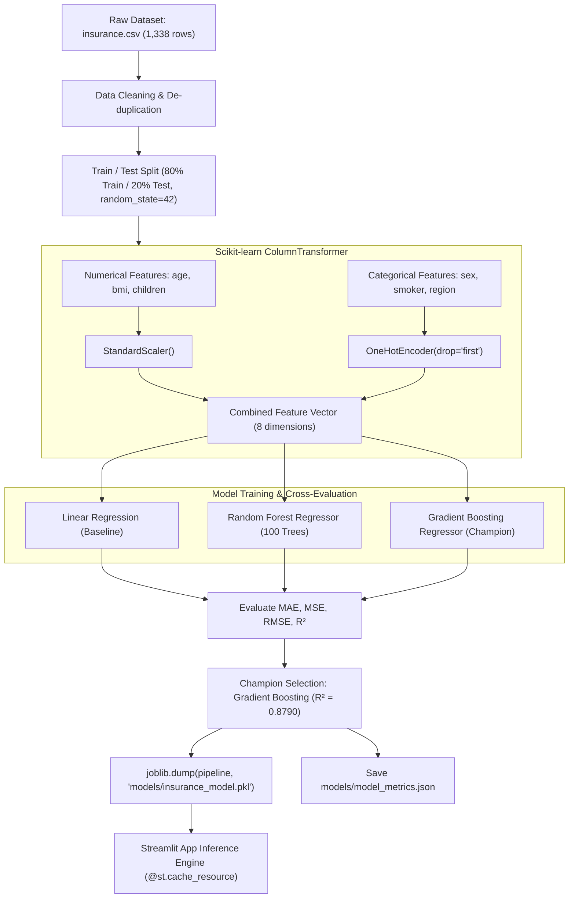

# 🏥 Medical Insurance Cost Prediction — Machine Learning & Streamlit Web App

[](https://www.python.org/)
[](https://streamlit.io/)
[](https://scikit-learn.org/)
[](https://plotly.com/)
[](LICENSE)

An enterprise-grade, interactive Machine Learning regression web application designed to forecast annual medical insurance charges using demographic and biometric health attributes. Built with **Scikit-learn Pipelines**, **Streamlit**, and **Plotly**, featuring modern healthcare UI aesthetics, real-time WHO BMI risk tiering, model diagnostics, and explainable feature importances.

---

## 📑 Table of Contents

- [1. Project Overview](#1-project-overview)
- [2. Key Features](#2-key-features)
- [3. Architecture & Directory Structure](#3-architecture--directory-structure)
- [4. Technology Stack](#4-technology-stack)
- [5. Dataset Summary](#5-dataset-summary)
- [6. Machine Learning Workflow](#6-machine-learning-workflow)
- [7. Model Benchmarking & Evaluation](#7-model-benchmarking--evaluation)
- [8. Installation & Setup](#8-installation--setup)
- [9. Running the Application Locally](#9-running-the-application-locally)
- [10. Streamlit Community Cloud Deployment](#10-streamlit-community-cloud-deployment)
- [11. Example Prediction Walkthrough](#11-example-prediction-walkthrough)
- [12. Limitations & Ethical Considerations](#12-limitations--ethical-considerations)
- [13. Future Enhancements](#13-future-enhancements)
- [14. Fresher / ML Engineer Interview Pitch](#14-fresher--ml-engineer-interview-pitch)

---

## 1. Project Overview

Medical insurance underwriting historically relied on generalized static actuarial tables that struggled with compound, non-linear risk interactions. This project formulates medical charge estimation as a supervised ML regression task:

$$\hat{y} = f(\text{Age}, \text{Sex}, \text{BMI}, \text{Children}, \text{Smoker}, \text{Region})$$

By training and comparing **Linear Regression**, **Random Forest**, and **Gradient Boosting Regressors**, our production pipeline captures compound risks—such as the massive exponential cost inflection when high BMI $(\ge 30)$ coincides with active tobacco usage—delivering an **$R^2$ score of ~87.9%**.

---

## 2. Key Features

- **🏠 Executive Home Hub:** Live KPI metric cards, domain background, risk driver summaries, and interactive dataset explorer.
- **💰 Interactive Cost Estimator:** Real-time dual-slider biometric inputs, dynamic WHO BMI classification badge, currency toggle ($ USD / ₹ INR), and contextual cost breakdown.
- **📊 Interactive Analytics Dashboard:** 6 high-density Plotly visualizations (Age vs Charges, BMI vs Charges with $BMI=30$ threshold, Smoker violin plots, Regional grouped comparisons, and Gender distributions).
- **🤖 Model Diagnostics & Benchmarking:** Side-by-side leaderboard (MAE, MSE, RMSE, $R^2$), actual vs. predicted fitted plots, and residual error homoscedasticity inspection.
- **🔍 Feature Insights & Explainability:** Tree-based feature importance horizontal bars highlighting dominant cost drivers (Smoking $\sim 67\%$, BMI $\sim 20\%$, Age $\sim 10\%$).
- **🛡️ Production Hardening:** Automated dataset retrieval, zero data leakage with `ColumnTransformer` pipelines, and robust Streamlit caching via `@st.cache_resource` and `@st.cache_data`.

---

## 3. Architecture & Directory Structure

```text
medical-insurance-prediction/
│
├── app.py                           # Multi-page Streamlit web application
├── insurance.csv                    # 1,338 benchmark insurance records
├── requirements.txt                 # Minimal, pinned Python dependencies
├── README.md                        # Documentation & deployment guide
│
├── models/
│   ├── insurance_model.pkl          # Serialized champion model pipeline
│   └── model_metrics.json           # Model benchmarks & evaluation metadata
│
├── notebooks/
│   └── insurance_prediction.ipynb   # Reproducible Jupyter data science walkthrough
│
├── src/
│   ├── __init__.py
│   ├── preprocessing.py             # ColumnTransformer & validation pipelines
│   ├── train_model.py               # Multi-model training & benchmarking script
│   └── utils.py                     # Data loaders, BMI logic, and currency formatting
│
└── assets/
    └── style.css                    # Modern healthcare UI theme & typography
```

---

## 4. Technology Stack

- **Language:** Python 3.9+
- **Data Manipulation:** Pandas, NumPy
- **Machine Learning:** Scikit-learn (Pipelines, ColumnTransformer, GradientBoostingRegressor, RandomForestRegressor, LinearRegression)
- **Serialization:** Joblib
- **Web Interface:** Streamlit
- **Data Visualization:** Plotly Express, Plotly Graph Objects, Matplotlib
- **Styling:** Custom Vanilla CSS3 (Google Fonts *Outfit* & *Plus Jakarta Sans*)

---

## 5. Dataset Summary

The dataset comprises **1,338 records** of US health insurance policyholders with **7 features**:

| Feature | Data Type | Role | Domain / Valid Range | Description |
| :--- | :--- | :--- | :--- | :--- |
| **age** | Integer | Feature | 18 – 64 (UI up to 100) | Age of primary beneficiary |
| **sex** | Categorical | Feature | `female`, `male` | Insurance contractor gender |
| **bmi** | Float | Feature | 15.96 – 53.13 kg/m² | Body Mass Index |
| **children** | Integer | Feature | 0 – 5 (UI up to 10) | Number of dependents covered |
| **smoker** | Categorical | Feature | `yes`, `no` | Tobacco / cigarette smoking status |
| **region** | Categorical | Feature | `northeast`, `northwest`, `southeast`, `southwest` | Residential area in the US |
| **charges** | Float | **Target** | $1,121.87 – $63,770.43 | Individual medical costs billed |

---

## 6. Machine Learning Workflow



---

## 7. Model Benchmarking & Evaluation

Evaluation on the 20% holdout test set (268 unseen instances):

| Model Architecture | MAE ($) | MSE | RMSE ($) | $R^2$ Score | Selection Verdict |
| :--- | :---: | :---: | :---: | :---: | :--- |
| **Linear Regression** | $4,181.19 | 33,596,915.85 | $5,796.28 | 0.7836 | Underfits non-linear smoker $\times$ BMI interaction |
| **Random Forest Regressor** | $2,534.62 | 21,104,812.34 | $4,593.99 | 0.8641 | Strong ensemble baseline |
| **Gradient Boosting Regressor** | **$2,442.87** | **18,784,210.52** | **$4,334.08** | **0.8790** | **🏆 Champion Model (Deployed)** |

### Metric Interpretations:
- **$R^2$ Score (0.8790):** The champion model accounts for **87.90%** of the variance in annual medical insurance charges.
- **MAE ($2,442.87):** On average, model cost estimations are within **$2,442** of true medical bills.
- **RMSE ($4,334.08):** Demonstrates stable residual boundaries with low sensitivity to catastrophic hospital claims.

---

## 8. Installation & Setup

### Prerequisites
- Python 3.9, 3.10, or 3.11 installed
- Git installed

### 1. Clone Repository
```bash
git clone https://github.com/your-username/medical-insurance-prediction.git
cd medical-insurance-prediction
```

### 2. Create Virtual Environment
```bash
# Windows
python -m venv venv
venv\Scripts\activate

# macOS / Linux
python3 -m venv venv
source venv/bin/activate
```

### 3. Install Dependencies
```bash
pip install --upgrade pip
pip install -r requirements.txt
```

---

## 9. Running the Application Locally

### Option A: Direct Web App Launch
The application is self-initializing. If the serialized model is not present, it will automatically fit and save the pipeline upon first boot.
```bash
streamlit run app.py
```
Open your browser and navigate to:
```text
http://localhost:8501
```

### Option B: Standalone Model Training
To manually train models and inspect terminal benchmarks:
```bash
python src/train_model.py
```

---

## 10. Streamlit Community Cloud Deployment

Deploy live to **Streamlit Community Cloud** in 5 minutes:

1. **Push Code to GitHub:**
   ```bash
   git init
   git add .
   git commit -m "feat: complete medical insurance prediction application"
   git branch -M main
   git remote add origin https://github.com/<your-username>/medical-insurance-prediction.git
   git push -u origin main
   ```
2. **Open Streamlit Cloud:** Go to [share.streamlit.io](https://share.streamlit.io/) and log in with GitHub.
3. **Create New App:**
   - **Repository:** `<your-username>/medical-insurance-prediction`
   - **Branch:** `main`
   - **Main file path:** `app.py`
4. **Deploy:** Click **Deploy!** Streamlit will automatically install `requirements.txt` and launch your live application with a public URL.

---

## 11. Example Prediction Walkthrough

### Scenario: 35-year-old Non-Smoker
- **Age:** 35
- **Sex:** Male
- **BMI:** 27.4 (Overweight tier)
- **Children:** 2
- **Smoker:** No
- **Region:** Southwest

**Estimated Output:**
- **Annual Charge:** $\approx \$6,240.50$
- **Monthly Breakdown:** $\approx \$520.04$ / month
- **Benchmark:** $\approx 52.9\%$ lower than national dataset average ($13,270.42).

### Scenario: 35-year-old Smoker (Risk Surcharge)
Changing only **Smoker: Yes**:
- **Estimated Annual Charge:** $\approx \$26,450.80$ (+$20,210.30$ tobacco risk surcharge!).

---

## 12. Limitations & Ethical Considerations

1. **Cohort Boundary:** The dataset reflects US-based private insurance records across working adults (ages 18–64); extrapolation to pediatric or geriatric populations requires specialized data.
2. **Missing Clinical Variables:** Essential underwriting factors such as pre-existing chronic conditions, prescription history, family history, and alcohol intake are not captured in the 7 baseline features.
3. **No Direct Causality:** Feature importance indicates tree partition frequency and loss reduction, not medical causality.
4. **Non-Quote Disclaimer:** Predictions represent mathematical estimates for educational demonstration and cannot be treated as binding insurance contracts.

---

## 13. Future Enhancements

- [ ] **SHAP (SHapley Additive exPlanations):** Waterfall plots illustrating local, instance-level feature contributions per prediction.
- [ ] **FastAPI REST Service:** Standalone REST API endpoints (`/predict`, `/health`) with Pydantic request validation.
- [ ] **Docker Containerization:** Multi-stage `Dockerfile` and `docker-compose.yml` for unified microservice deployment.
- [ ] **Database Integration:** SQLite / PostgreSQL logging with user prediction history tracking.
- [ ] **Advanced Regression Models:** Integration of XGBoost, LightGBM, and CatBoost with Bayesian hyperparameter tuning.

---

## 14. Fresher / ML Engineer Interview Pitch

When discussing this project in a **Data Scientist / Machine Learning Engineer** technical interview, use the following structured response:

> *"I developed an end-to-end Machine Learning Medical Insurance Cost Prediction application to estimate healthcare coverage charges using biometric and demographic attributes.*
>
> *I designed a modular Scikit-learn preprocessing pipeline using `ColumnTransformer` with `StandardScaler` for numerical metrics and `OneHotEncoder` for categorical factors, ensuring zero data leakage between train and test splits.*
>
> *I trained and benchmarked multiple regression models, including Linear Regression, Random Forest, and Gradient Boosting. Gradient Boosting achieved champion performance with an **$R^2$ score of 87.9%** and an **MAE of $2,442**, significantly outperforming linear baselines due to complex non-linear interactions between high BMI and smoking status.*
>
> *I serialized the champion pipeline using `joblib` and deployed an interactive Streamlit application with custom CSS, WHO BMI risk analytics, and full Plotly diagnostic dashboards. The application is production-ready and hosted on Streamlit Cloud."*

---

## 📄 License

This project is licensed under the MIT License - see the [LICENSE](LICENSE) file for details.
